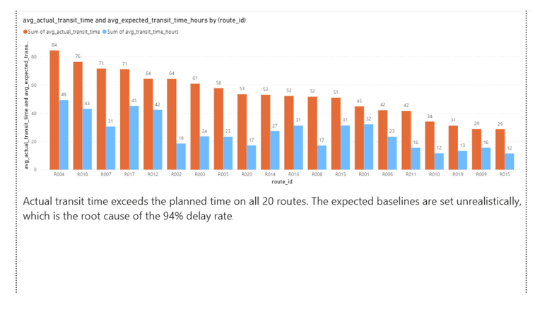
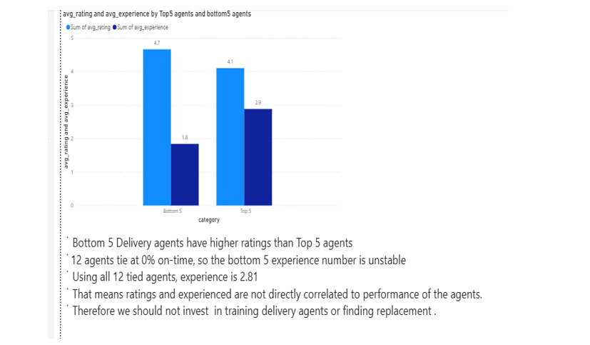
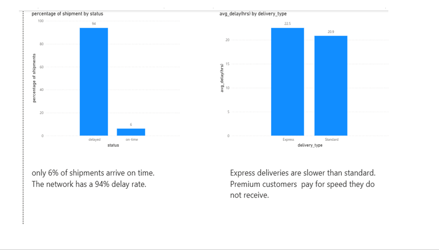
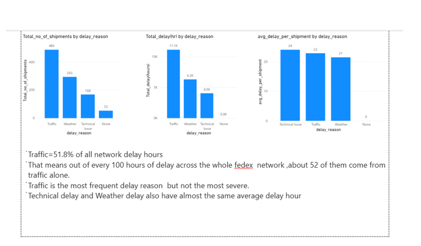
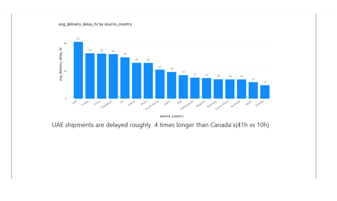

# FedEx Logistics Optimization Dashboard

End-to-end logistics analytics project combining **SQL (MySQL)** for data modeling and querying with **Power BI** for interactive reporting. Built to surface shipment delays, route efficiency, and cost drivers across a logistics network.

## Overview

This project analyzes shipment, route, and delivery data to answer operational questions such as: which lanes are slowest, where delays concentrate, how cost scales with distance and weight, and which carriers and hubs underperform. SQL handles the heavy data transformation; Power BI delivers the visual layer.

## Dashboard Screenshots

### Actual vs Expected Transit Time


### Agent Performance


### Shipment Delay Analysis


### Traffic Delay


### Source Country Analysis



## Tech Stack

- **MySQL Workbench** — data cleaning, joins, CTEs, window functions, conditional aggregation, date arithmetic
- **Power BI Desktop** — data model, DAX measures, interactive dashboard
- **Power BI Service** — published dashboard and refresh

## Key Analyses

- On-time vs. delayed delivery rate by route, hub, and carrier
- Average transit time and delay distribution using window functions (`RANK`, `LAG`, `LEAD`)
- Cost-per-shipment breakdown by distance and weight band
- Date arithmetic to compute SLA breaches and dwell time
- Conditional aggregation to compare performance across categories

## SQL Highlights

The query layer demonstrates:
- Multi-table `JOIN`s across shipments, routes, and hubs
- `CTE`s for staged, readable transformations
- Window functions for ranking routes and computing rolling metrics
- `CASE` expressions for SLA flagging and bucketing
- Date functions for transit-time and delay calculations

## Power BI Highlights

- Star-schema data model with fact and dimension tables
- DAX measures for on-time %, average delay, and cost metrics
- `CALCULATE` with filter context for sliced KPIs
- Time-intelligence measures via `DATEADD`
- Multi-page report: overview, route performance, cost analysis

## Repository Structure

```
/images                          -- dashboard screenshots
Fedex_logistics_optimization.sql -- schema, cleaning, and analysis queries
logistics_optimization.pbix      -- Power BI report
Presentation1.pptx               -- project presentation
README.md
```

## How to Run

1. Create the schema and load data using the scripts in `/sql`.
2. Run the analysis queries to validate the data model.
3. Open the `.pbix` file in Power BI Desktop and point the source to your MySQL instance.
4. Refresh to populate visuals.

## Author

**Rahul** — Data Analytics | SQL · Power BI · Python
